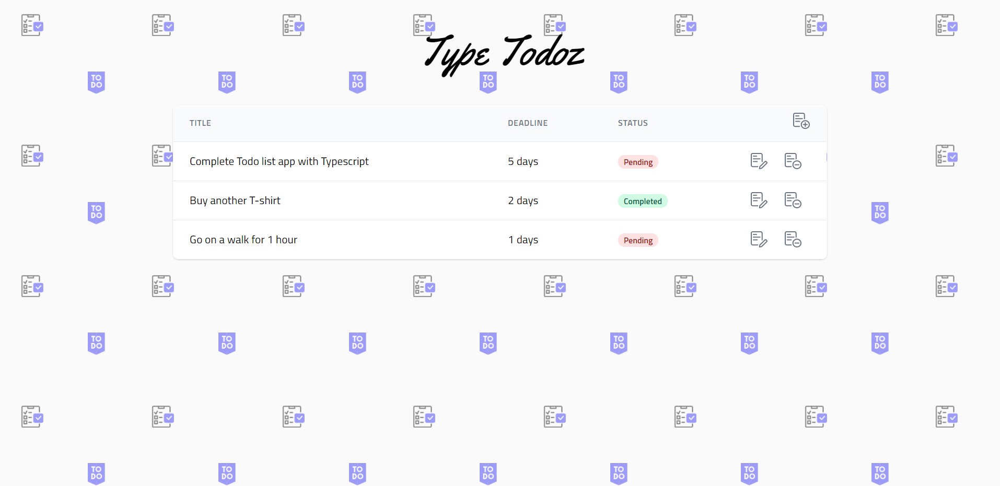

## TypeTodoz 📝
This is the classical Todo App with a twist of using Typescript.

***

#### Built With

- [React.js](https://reactjs.org) - A JavaScript library for building user interfaces.
- [Tailwind CSS](https://tailwindcss.com) - A utility-first CSS framework for rapidly building custom designs.
- [React Hook Form](https://react-hook-form.com) - Performant, flexible and extensible forms with easy-to-use validation.
- [react-responsive-modal](https://react-responsive-modal.leopradel.com) - A simple responsive and accessible react modal.
- [flaticon](https://flaticon.com) - Free Vector Icons and Stickers.

#### Getting Started

- Run `yarn install && yarn start` to run the app successfully.
